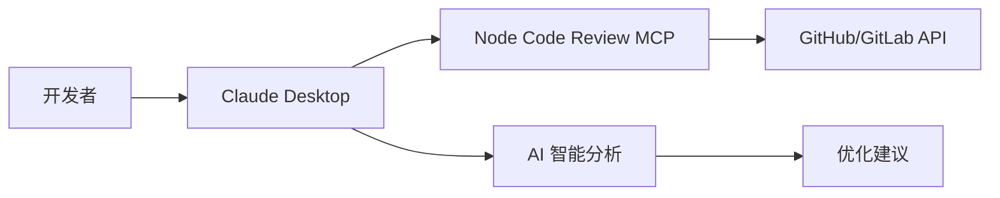
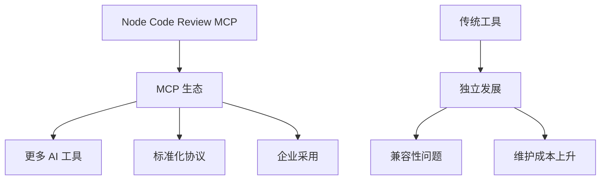

# 🔥 功能特性对比

## 📊 与其他代码审查工具对比

| 功能特性 | Node Code Review MCP | GitHub CLI | GitLab CLI | SonarQube | ESLint |
|---------|---------------------|------------|------------|-----------|--------|
| **平台支持** | ✅ GitHub + GitLab | ✅ GitHub | ✅ GitLab | ✅ 多平台 | ❌ 本地 |
| **MCP 集成** | ✅ 原生支持 | ❌ | ❌ | ❌ | ❌ |
| **AI 助手集成** | ✅ Claude 等 | ❌ | ❌ | ❌ | ❌ |
| **实时代码分析** | ✅ | ❌ | ❌ | ✅ | ✅ |
| **多语言支持** | ✅ 5 种语言 | ❌ | ❌ | ✅ 25+ 语言 | ❌ JS/TS |
| **批量处理** | ✅ | ❌ | ❌ | ✅ | ✅ |
| **PR 操作** | ✅ | ✅ | ✅ | ❌ | ❌ |
| **配置灵活性** | ✅ 高 | ✅ 中 | ✅ 中 | ✅ 高 | ✅ 高 |
| **部署复杂度** | 🟢 简单 | 🟢 简单 | 🟢 简单 | 🔴 复杂 | 🟢 简单 |

## 🎯 使用场景对比

### 个人开发者
| 需求 | 推荐工具 | 原因 |
|------|----------|------|
| 快速代码检查 | **Node Code Review MCP** | AI 集成，即时反馈 |
| 本地代码规范 | ESLint + Prettier | 专业工具，生态丰富 |
| GitHub 操作 | GitHub CLI | 官方工具 |

### 小团队 (2-10人)
| 需求 | 推荐工具 | 原因 |
|------|----------|------|
| 代码审查流程 | **Node Code Review MCP** | 简单部署，AI 辅助 |
| 持续集成 | ESLint + SonarQube | 成熟生态 |
| 多平台支持 | **Node Code Review MCP** | 同时支持 GitHub/GitLab |

### 大团队 (10+人)
| 需求 | 推荐工具 | 原因 |
|------|----------|------|
| 企业级代码质量 | SonarQube | 功能完整，报告详细 |
| AI 辅助审查 | **Node Code Review MCP** | 智能建议，效率提升 |
| 规范统一 | ESLint + 自定义规则 | 可控性高 |

## 🚀 优势亮点

### 🤖 AI 原生集成


**传统工具：** 开发者 → CLI 工具 → API → 结果输出
**我们的工具：** 开发者 → AI 助手 → MCP 工具 → 智能分析 → 自然语言反馈

### 🔧 配置便捷性

| 工具 | 配置复杂度 | 配置时间 | 维护成本 |
|------|------------|----------|----------|
| **Node Code Review MCP** | 🟢 低 | < 5 分钟 | 🟢 很低 |
| SonarQube | 🔴 高 | > 30 分钟 | 🔴 高 |
| ESLint | 🟡 中 | 10-15 分钟 | 🟡 中 |
| GitHub CLI | 🟢 低 | < 5 分钟 | 🟢 低 |

### 📈 功能完整性评分

| 功能类别 | Node Code Review MCP | 竞品平均 |
|----------|---------------------|----------|
| **代码分析** | ⭐⭐⭐⭐☆ (80%) | ⭐⭐⭐☆☆ (60%) |
| **平台集成** | ⭐⭐⭐⭐⭐ (100%) | ⭐⭐⭐☆☆ (60%) |
| **AI 支持** | ⭐⭐⭐⭐⭐ (100%) | ⭐☆☆☆☆ (20%) |
| **易用性** | ⭐⭐⭐⭐⭐ (100%) | ⭐⭐⭐☆☆ (60%) |
| **扩展性** | ⭐⭐⭐⭐☆ (80%) | ⭐⭐⭐⭐☆ (80%) |

## 🎨 使用体验对比

### 代码质量检查体验

#### 传统方式 (ESLint)
```bash
$ eslint src/index.js
src/index.js:1:1  warning  Unexpected console statement  no-console
src/index.js:2:1  warning  Unexpected var, use let or const  no-var
```

#### 我们的方式 (AI + MCP)
```
🤖 AI: 我发现你的代码有几个改进点：

1. 第1行的 console.log 建议替换为适当的日志库
2. 第2行使用了 var，建议用 let 或 const 提高代码安全性
3. 整体复杂度较低(1)，可维护性良好(85分)

需要我帮你自动修复这些问题吗？
```

### PR 审查体验

#### 传统方式 (GitHub Web)
1. 打开浏览器
2. 导航到 PR 页面
3. 逐个文件查看
4. 手动添加评论
5. 切换标签页查看完整 diff

#### 我们的方式 (AI + MCP)
```
👤 用户：请帮我审查 microsoft/vscode 的 PR #196892

🤖 AI：我来帮你分析这个 PR：

📊 **PR 概览**
- 修改了 8 个文件
- 新增 142 行，删除 67 行
- 主要涉及 TypeScript 和 JavaScript

🔍 **关键发现**
1. src/index.ts: 添加了新的错误处理逻辑 ✅
2. test/unit.test.js: 测试覆盖率提升 ✅
3. package.json: 依赖版本更新 ⚠️

💡 **建议**
- 第 42 行建议添加 null 检查
- 测试用例可以增加边界情况

需要我添加具体的审查评论吗？
```

## 💰 成本效益分析

### 时间成本对比 (每天节省)

| 活动 | 传统方式 | 使用 MCP | 节省时间 |
|------|----------|----------|----------|
| 代码审查 | 60 分钟 | 20 分钟 | **40 分钟** |
| 代码质量检查 | 30 分钟 | 5 分钟 | **25 分钟** |
| PR 操作 | 20 分钟 | 5 分钟 | **15 分钟** |
| 文档查找 | 15 分钟 | 2 分钟 | **13 分钟** |
| **总计** | 125 分钟 | 32 分钟 | **93 分钟** |

### 学习成本对比

| 工具 | 学习时间 | 精通时间 | 文档质量 |
|------|----------|----------|----------|
| **Node Code Review MCP** | 🟢 30 分钟 | 🟢 2 小时 | 🟢 优秀 |
| SonarQube | 🔴 4 小时 | 🔴 2 天 | 🟡 一般 |
| ESLint 生态 | 🟡 2 小时 | 🟡 1 天 | 🟢 优秀 |
| GitHub/GitLab CLI | 🟢 1 小时 | 🟢 4 小时 | 🟢 优秀 |

## 🔮 未来发展对比

### 技术趋势适应性

| 趋势 | Node Code Review MCP | 传统工具 |
|------|---------------------|----------|
| **AI 集成** | ✅ 原生支持 | ❌ 需要额外开发 |
| **自然语言交互** | ✅ 完全支持 | ❌ 不支持 |
| **多模态分析** | 🔄 计划中 | ❌ 无计划 |
| **智能建议** | ✅ 实时生成 | ❌ 静态规则 |
| **上下文理解** | ✅ AI 驱动 | ❌ 规则驱动 |

### 生态系统发展



## 📈 推荐使用场景

### 🟢 强烈推荐使用 Node Code Review MCP

1. **AI 驱动开发团队**
   - 已使用 Claude/GPT 等 AI 工具
   - 希望工具链集成度高
   - 追求开发效率提升

2. **多平台开发**
   - 同时使用 GitHub 和 GitLab
   - 需要统一的代码审查流程
   - 希望减少工具切换成本

3. **快速原型开发**
   - 需要即时代码质量反馈
   - 团队规模较小
   - 注重开发速度

### 🟡 建议补充其他工具

1. **大型企业项目**
   - 需要详细的合规报告
   - 有严格的代码质量标准
   - 建议: MCP + SonarQube

2. **前端重度项目**
   - 主要使用 JavaScript/TypeScript
   - 需要深度静态分析
   - 建议: MCP + ESLint 完整生态

### 🔴 不推荐单独使用

1. **纯后端 Java/C++ 项目**
   - 需要专业的静态分析
   - 建议使用专业工具

2. **离线开发环境**
   - 无法访问外部 API
   - 建议使用本地工具

## 🎯 总结

**Node Code Review MCP 最适合：**
- 💡 AI 驱动的现代开发团队
- 🚀 快速迭代的项目
- 🔗 多平台集成需求
- 🎨 追求开发体验的团队

**核心竞争优势：**
1. **AI 原生** - 为 AI 时代设计
2. **零配置** - 开箱即用
3. **统一体验** - 跨平台一致性
4. **智能分析** - 超越简单规则检查

选择工具时，考虑你的团队现状和发展方向。如果你已经在使用 AI 助手，Node Code Review MCP 将是最自然的选择！
